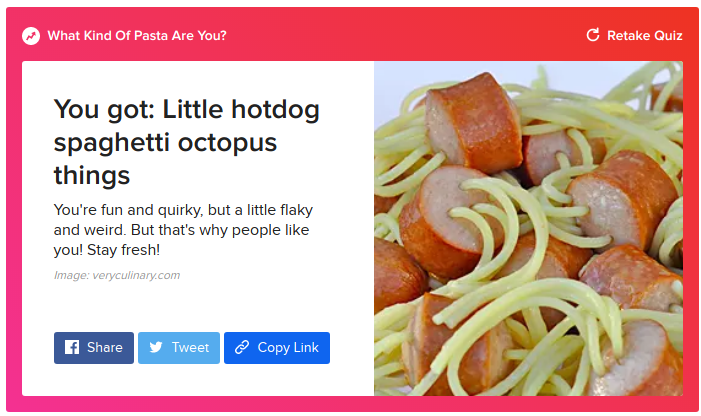
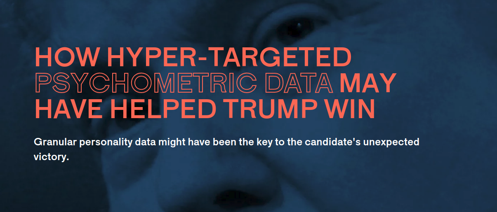
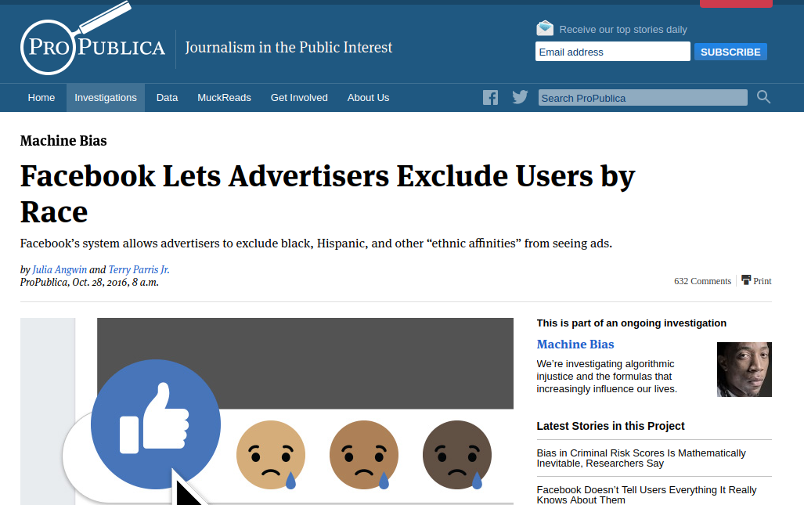
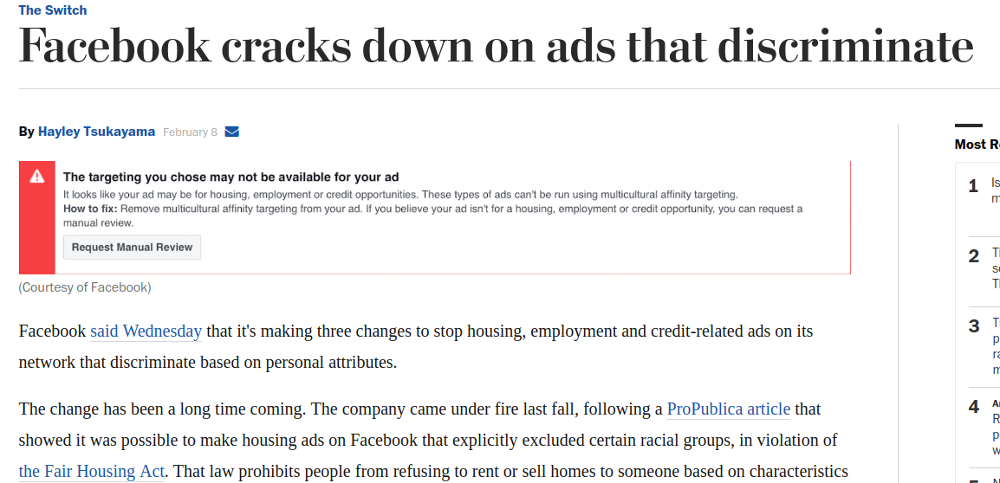
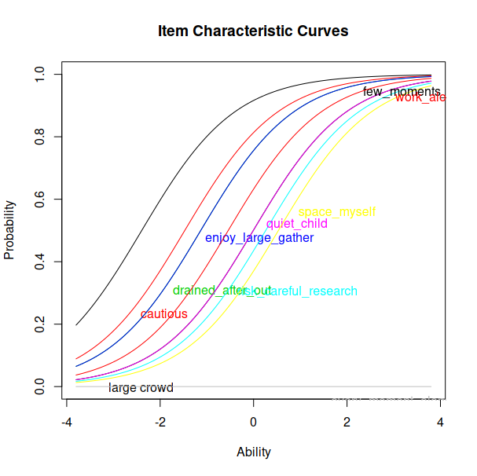

```{r setup, include=FALSE}
knitr::opts_chunk$set(echo = FALSE)
```

## Disclaimer

> - This is about the general method for making these types of inferences.
> - I don't actually know the details of facebook's particular implementation.
> - Or how buzzfeed grades their quizzes.

---

<center>

</center>

---

<center>

</center>

---


---

New York Times


---

<center>

</center>

---

<https://applymagicsauce.com/>


## Cambridge University, Psychometrics Centre

* Michal Kosinski, a psychologist with the Psychometrics Centre at Cambrige University
* 2008 - looking at Facebook quizzes that focused on what psychologists call "The Big Five" personality traits: openness, conscientiousness, extroversion, agreeableness, and neuroticism, or OCEAN.
* "The quiz-takers could opt in to sharing their data with the researchers, and to the researchers' surprise, millions did."

---

* 2012 - "Kosinski proved that on the basis of an average of 68 Facebook 'likes' by a user, it was possible to predict:
    * their skin color (with 95 percent accuracy)
    * their sexual orientation (88 percent accuracy)
    * their affiliation to the Democratic or Republican party (85 percent)
* Also: intelligence; religion; alcohol, cigarette and drug use, whether someone's parents were divorced
* 'Liking' Wu-Tang Clan is one of the best indicators for heterosexuality
* 'Liking' Lady Gaga correlated highly with extroversion.
* "Eventually, Facebook made 'like' data private, but researchers could still collect it by asking users to opt in."


## Politics


https://theoutline.com/post/969/did-trump-win-psychometrics-data-cambridge-analytica

## Politics

"So what does all this have to do with elections? In 2014, a young assistant professor named Aleksandr Kogan requested access to Kosinski's database on behalf of an “election management agency” based in London called Strategic Communications Laboratories. Kosinski turned Kogan down, but Kogan went ahead and registered a company under SCL's umbrella called Cambridge Analytica — an homage, he said, to the university's work in the field. Cambridge Analytica, under CEO Alexander Nix, went on to work for the pro-Brexit campaign, Senator Ted Cruz's presidential nomination bid, and then on Donald Trump's presidential campaign."

"On the day of the third presidential debate between Trump and Clinton, Trump’s team tested 175,000 different ad variations for his arguments"


## Back To Facebook


<!--https://www.propublica.org/article/facebook-lets-advertisers-exclude-users-by-race-->


## Washington Post {#lrg}


<!--https://www.washingtonpost.com/news/the-switch/wp/2017/02/08/facebook-cracks-down-on-ads-that-discriminate/-->

## It's not all bad

* Medical care, e.g. diabetes
* Education, e.g. adaptive testing

## Measurement

* You take a quiz, and get a 78%. What does this mean?

* You take a survey and find out you are 63% democrat, or 71% republican? What does this mean?
<center>

</center>

## A Definition {.build}

* What does it mean to measure something?

According to Stevens (1946), measurement is <span style="color:red">“the assignment of numerals according to rules”</span>

## Another Definition

According to Wright (1997), measures should be:

1. <span style="color:blue">unidimensional</span>

2. <span style="color:blue">sample-independent</span>
    * what we measure should not depend on what we use to measure it
    * individuals as well as item characteristics
3. <span style="color:blue">invariantly comparable</span>
    * Higher “ability” means higher probability of answering a question correctly, no matter the question
4. <span style="color:blue">additive</span>
    * Difference in ability is independent of items used, and difference in difficulties should be independent of the people being measured

## Classical Test Theory

* The "old method"
* Focused on total scores

## Psychometrics: A Probabilistic Framework {.build}
* Questions have "difficulties"
* People have "abilities"
* Questions *can* have other attributes (depending on the model)

Messy notation:

* $\theta_i$ - person's $i$'s ability
* $b_j$ - question $j$'s difficulty
* $P_{i,j}$ - person $i$'s probability of answering question $j$ correctly
    * Technically $P(X_{i,j}=1|\theta_i,b_j)$

## More measurement

* Types of variables: nominal, ordinal, scale, ratio
* What operations make sense for each?
* Likert questions

## Differences

> * What does $P_{a,j} – P_{a,k}$ mean?
> * What does $P_{i,b} - P_{j,b}$ mean?
> * What does $\theta_p – \theta_q$ mean?
> * What does $b_p-b_q$ mean?
> * What values could each of these differences take?

## What should the curves look like?

* What would we expect the curves relating probability of answering a question correctly / agreeing with a statement vs ability to look like?

## What do the curves look like? {#med .build}

What should a curve relating the abilities and probabilities look like? (Use ability as the independent variable)

<center>


</center>


## What kind of function?

* $\theta_A$ - $\theta_B$ should be meaningful, and should not depend on the items used (specific objectivity)

* How are $P_{Ai}$ and $P_{Bi}$ related to $\theta_A$ and $\theta_B$? Could it be that $P_{Ai} - P_{Bi}$ = $\theta_A - \theta_B$?
    * Domains: $\theta_{A}$ can be any real number, $P_{Ai}$ is between 0 and 1
* Let's fix it
    * Consider odds: $D_{Ai} = \frac{P_{Ai}}{1-P_{Ai}}$
    * $D_{Ai}$ lies between 0 and $\infty$.
    * $\ln(D_{Ai})$ lies between $-\infty$ and $\infty$.
* Now, maybe $\ln(D_{Ai})-\ln(D_{Bi}) = \theta_A - \theta_B$, or equivalently, $\ln \left( \frac{P_{Ai}}{1-P_{Ai}} \right)-\ln \left( \frac{P_{Bi}}{1-P_{Bi}} \right) = \theta_A - \theta_B$

## What kind of function?

* What about the same person answering two questions?
* By similar logic to the last slide, it is reasonable that
\[
b_m-b_n = \ln \left( \frac{P_{Am}}{1-P_{Am}} \right) - \ln \left( \frac{P_{An}}{1-P_{An}} \right)
\]

* Now difficulty and ability are on the same scale

## Putting things together
$\theta_A - \theta_B = \ln \left( \frac{P_{Ai}}{1-P_{Ai}} \right)-\ln \left( \frac{P_{Bi}}{1-P_{Bi}} \right)$ means $\theta_A = \ln \left( \frac{P_{Ai}}{1-P_{Ai}} \right) + C_1$

and

$b_m-b_n = \ln \left( \frac{P_{Am}}{1-P_{Am}} \right) - \ln \left( \frac{P_{An}}{1-P_{An}} \right)$ means $b_m = \ln \left( \frac{P_{Am}}{1-P_{Am}} \right) + C_2$

This means $C_1 = b_m$ and $C_2 = \theta_A$. Therefore,
$\theta_A - b_m = \ln \left( \frac{P_{Am}}{1-P_{Am}} \right)$

Solve for $P_{Am} = \dfrac{exp(\theta_A-b_m)}{1+exp(\theta_A-b_m)}$

---

\[
P_{i,j} = \dfrac{e^{\theta_i-b_j}}{1+e^{\theta_i-b_j}}
\]

This is the probability that person $i$ will correctly answer question $j$ correctly.

## A few items {#lrg}

<center>

</center>

## Some analysis!

* Analyzing the test
* Analyzing the results

## Questions

* I quickly feel drained when in a large crowd of people
* I am a cautious decision maker
* I feel drained after being out and about, even if I've enjoyed myself
* I enjoy large gatherings of people
* I don’t take risks unless I've done some careful research or evaluation first
* When I was a child, people described me as "quiet"
* In large social gatherings, I often feel a need to seek out space to be by myself
* If possible, I would spend every single moment by myself
* I like to spend at least a few moments alone every day
* I prefer to work alone than with others

## Rasch

```{r include=FALSE}
require(ltm)
require(tidyverse)
talk <- read_csv("data.csv")

talk <- talk %>% select(-1)

talk <- replace(talk, talk =="Disagree", 0)
talk <- replace(talk, talk =="Agree", 1)

names(talk) <- c("large crowd", "cautious","drained_after_out", "enjoy_large_gather", "risk_careful_research", "quiet_child", "space_myself", "every_moment_alone", "few_moments_alone", "work_alone")
mod.rasch <- rasch(talk, constraint = cbind(ncol(talk) + 1, 1))
mod.rasch
```

```{r}
coef(mod.rasch, prob=TRUE, order=TRUE)
```

## Graph

<center>
```{r fig.height=5.5, fig.width=10}
plot(mod.rasch)
```
</center>

## 1PL

```{r include=FALSE}
mod.1pl <- rasch(talk)
```

```{r}
coef(mod.1pl, prob=TRUE, order=TRUE)
```

## Graph

<center>
```{r fig.height=5.5, fig.width=10}
plot(mod.1pl)
```
</center>

<!--
## 1PL vs Rasch

```{r}
anova(mod.rasch, mod.1pl)
```

-->

## 2PL

```{r include=FALSE}
mod.2pl <- ltm(talk ~ z1)
```

```{r}
coef(mod.2pl, prob=TRUE, order=TRUE)
```

## Plots

<center>
```{r fig.height=5.5, fig.width=10}
plot(mod.2pl)
```
</center>

## 3PL

```{r include=FALSE}
mod.3pl <- tpm(talk, max.guessing = .2)
```

```{r}
coef(mod.3pl, prob=TRUE, order=TRUE)
```

## Plots

<center>
```{r fig.height=5.5, fig.width=10}
plot(mod.3pl)
```
</center>

## What does this mean for you?

We could either compare the models statistically, or try to make sense of which model might be reasonable.

What model might be good, and why?

## Let's consider the Rasch model

```{r}
coef(mod.rasch, order=TRUE)
```

This means the curve for "large_crowd" is:

$$\frac{exp(\theta+0.006014405)}{1+exp(\theta+0.006014405)}$$
etc.

## A hypothetical person

Suppose I said "agree" to everything before "enjoy_large_gather" and "disagree" to everything after

I'm indicating that I follow the curve for the early ones, but not the later ones.

## The likelihood function

Suppose we have functions $p_n(\theta) = \frac{exp(\theta - \beta_n)}{1+exp(\theta-\beta_n)}$

The "likelihood function" for my introversion is $p_1(\theta) \times p_2(\theta) \times p_3(\theta) \times p_4(\theta) \times (1-p_5(\theta)) \times (1-p_6(\theta)) \times (1-p_7(\theta)) \times (1-p_8(\theta)) \times (1-p_9(\theta)) \times (1-p_{10}(\theta))$

What does this actually look like???

---

```{r include=FALSE}
p <- function(x,a){return(exp(x-a)/(1+exp(x-a)))}
```

```{r}
curve(p(x,-2.393858933)*p(x,-1.472960963)*p(x,-1.131583530)*p(x,-1.131124476)*(1-p(x,-0.542596614))*(1-p(x,-0.006237960))*(1-p(x,-0.006014405))*(1-p(x,0.259495753))*(1-p(x,0.531349428))*(1-p(x,25.566068525)),-5,5)
```

## Actual Scores

```{r}
scores <- factor.scores(mod.rasch)
scores$score.dat$z1
```


